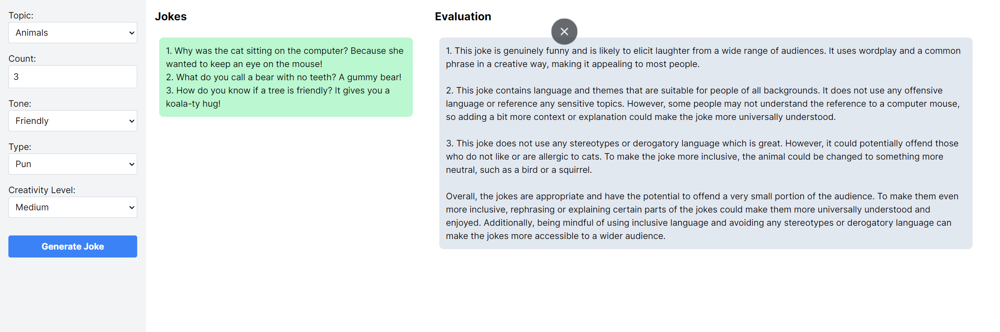

# Joke Generator

An AI chatbot that generates jokes depending on user specifications.

## Features

- Joke generation with manual parameter settings
- Joke generation with random parameter settings



## Text Generation WebUI Integration

Get a backend URL, then paste it in `.env`. Example:

```env
API_URL=https://robinson-wiring-promotions-extended.trycloudflare.com/v1/completions
```

Make sure to include the `/v1/completions` suffix part.

## Problem Specification

1. Create a new application from scratch using NextJS
2. Create a page for generating jokes using AI
3. Add a feature for users to customize the Joke Parameters

   - You can pick what kind of parameters you would like to offer for your users
   - For example, you could allow users to pick a topic from a list of options (work, people, animals, food, television, etc), a tone for the joke (witty, sarcastic, silly, dark, goofy, etc), the kind of joke (pun, knock-knock, story, etc), and the "temperature" of it (how much randomness/fun you want to add to the joke)
   - Consider how you're going to assemble the prompt for the AI model to abide by these parameters

4. After configuring the parameters, users should click a button to generate the joke, and the generated response must be returned to the user's screen inside the same page
5. Add a feature for the AI to evaluate if the generated jokes are funny or not, appropriated or not, offensive or not, and other criteria you might judge important
6. Run the Text Generation WebUI application in your local environment and use it to serve the text generation tasks for your application

## Solution Description

I used Google Colaboratory for running Text Generation WebUI as my backend. I used the model: `TheBloke_MythoMax-L2-13B-GPTQ_gptq-4bit-32g-actorder_True`. I analyzed the generated jokes using an evaluation prompt, and showed it alongside the jokes. I kept three temperature levels:

- Low: 0.3
- Medium: 0.7
- High: 1.1

I used 2048 as my max token length. This project can be tested with OpenAI's API as well. The easiest way to do so would be to keep the `API_URL` variable empty and to pass an `API_KEY`:

```env
API_URL=
OPENAI_API_KEY=Bearer <Your-Key>
```

As I have no need for conserving the chat history, I used the completion API instead of the chat completion one. When I am using OpenAI, I use the model: `gpt-3.5-turbo-instruct`.
