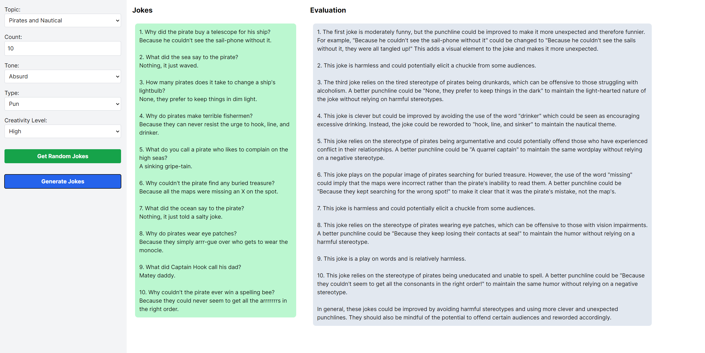

# Joke Generator

An AI chatbot that generates jokes depending on user specifications.

## Features



## Text Generation WebUI Integration

Get a backend URL, then paste it in `.env`. Example:

```env
API_URL=https://robinson-wiring-promotions-extended.trycloudflare.com/v1/completions
```

Make sure to include the suffix part.
